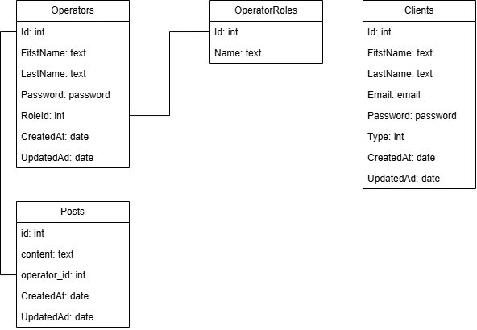

# 🏋️‍♂️ FitnessApp

Aplikacja fitness w **ASP.NET Core MVC** z użyciem **Entity Framework Core** i **SQLite**.  
Pozwala zarządzać operatorami (pracownikami) i ich rolami.

---

## ⚙️ Wymagania
- .NET SDK 8.0+
- Git
- SQLite (lub DB Browser for SQLite)
- Visual Studio / Rider / VS Code

---

## 🔧 Instalacja

```bash
git clone https://github.com/Pepko0/FitnessApp.git
cd FitnessApp
dotnet restore
dotnet tool install --global dotnet-ef
```

## 🗄️ Konfiguracja bazy danych

```bash
dotnet ef migrations add InitialCreate
dotnet ef database update
```

## Baza danych 



### Tabela: "Operators"

**`Operators`** – przechowuje dane pracowników (operatorów), takich jak imię, nazwisko, adres e-mail, hasło oraz przypisana rola.  
Każdy operator ma przypisaną jedną rolę (relacja *wiele do jednego* z tabelą `OperatorRoles`).

|       Id       | FirstName | LastName | Email | Password |      RoleId      | CreatedAt |        UpdatedAt        |
|:--------------:|:---------:|:--------:|:-----:|:---------:|:----------------:|:---------:|:-----------------------:|
| Id Pracownika  |   Imię    | Nazwisko | Email | Hasło | Rola pracownFika | Data utworzenia konta| Data aktualizacji konta |

#### Powiązane pliki:
- Models/Operator.cs – definicja modelu
- Views/Operators/Index.cshtml – widok listy operatorów
- Views/Shared/Components/Operators/_OperatorsTable.cshtml – tabela operatorów
- Views/Shared/Components/Operators/_AddOperatorModal.cshtml – formularz dodawania
- Controllers/OperatorsController.cs – kontroler obsługujący widok
- Services/OperatorService.cs – logika biznesowa


### Tabela: "OperatorRoles"
**`OperatorRoles`** – zawiera listę dostępnych ról w systemie (np. Administrator, Trener personalny, Dietetyk).  
Tabela służy do grupowania operatorów według ich funkcji w aplikacji.

|   Id    |    Name    |
|:-------:|:----------:|
| Id roli | Nazwa roli |

#### Powiązane pliki:
- Models/OperatorRole.cs – definicja modelu 
- Views/OperatorRole/Index.cshtml – widok listy ról 
- Views/Shared/Components/OperatorRole/_OperatorRolesTable.cshtml – tabela ról 
- Views/Shared/Components/OperatorRole/_AddRoleModal.cshtml – formularz dodawania roli 
- Controllers/OperatorRoleController.cs – kontroler obsługujący role 
- Services/OperatorRoleService.cs – logika biznesowa dla ról