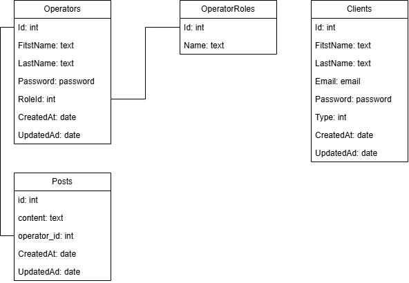

# Dokumentacja techniczna – FitnessApp

## 1. Opis projektu
**FitnessApp** - aplikacja webowa typu **ASP.NET Core MVC**, przeznaczona do zarządzania operatorami systemu fitness oraz ich rolami.  
Projekt wykorzystuje **Entity Framework Core** jako warstwę dostępu do danych oraz **SQLite** jako bazę danych.

Aplikacja została zaprojektowana w architekturze warstwowej, co ułatwia jej rozwój, testowanie oraz utrzymanie.

---

## 2. Stos technologiczny
- **Backend:** ASP.NET Core MVC (.NET)
- **ORM:** Entity Framework Core
- **Baza danych:** SQLite
- **Frontend:** Razor Views, HTML5, CSS3
- **JavaScript:** jQuery, jQuery Validation
- **Architektura:** MVC + Services
- **Kontrola wersji:** Git

---

## 3. Architektura aplikacji

### 3.1 Wzorzec MVC
Aplikacja została oparta na wzorcu **Model–View–Controller**:

- **Model** - reprezentuje dane i logikę domenową
- **View** - odpowiada za warstwę prezentacji
- **Controller** - obsługuje żądania HTTP i koordynuje działanie aplikacji

### 3.2 Warstwy aplikacji

1. **Controllers**
   - Obsługa żądań HTTP (GET, POST)
   - Walidacja danych wejściowych
   - Komunikacja z warstwą Services

2. **Services**
   - Logika biznesowa aplikacji
   - Operacje CRUD
   - Separacja logiki od kontrolerów

3. **Models**
   - Encje bazy danych
   - Atrybuty walidacyjne
   - Relacje między encjami

4. **Data**
   - `ApplicationDbContext`
   - Konfiguracja EF Core
   - Migracje bazy danych

5. **Views**
   - Widoki Razor (.cshtml)
   - Layouty i widoki współdzielone

---

## 4. Baza danych

### 4.1 Technologia
- SQLite
- Entity Framework Core
- Code First + migracje

### 4.2 Struktura tabel



## 5. Moduły funkcjonalne

### 5.1 Zarządzanie rolami operatorów
Funkcjonalności:
- Wyświetlanie listy ról
- Dodawanie nowych ról
- Walidacja danych
- Usuwanie ról

Powiązane pliki:
- `Models/OperatorRole.cs`
- `Controllers/OperatorRoleController.cs`
- `Services/OperatorRoleService.cs`
- `Views/OperatorRole/Index.cshtml`

### 5.2 Zarządzanie operatorami
Funkcjonalności:
- Tworzenie operatorów
- Przypisywanie ról
- Edycja danych operatora
- Usuwanie operatorów

---

## 6. Konfiguracja aplikacji

### 6.1 appsettings.json
Plik zawiera:
- konfigurację połączenia z bazą SQLite
- ustawienia środowiskowe aplikacji

### 6.2 Program.cs
- Rejestracja kontrolerów MVC
- Konfiguracja Dependency Injection
- Konfiguracja Entity Framework Core

---

## 7. Uruchomienie projektu

1. Rozpakuj projekt
2. Otwórz w Visual Studio / Rider / VS Code
3. Przywróć pakiety NuGet
4. Wykonaj migracje bazy danych:
   ```bash
   dotnet ef database update
